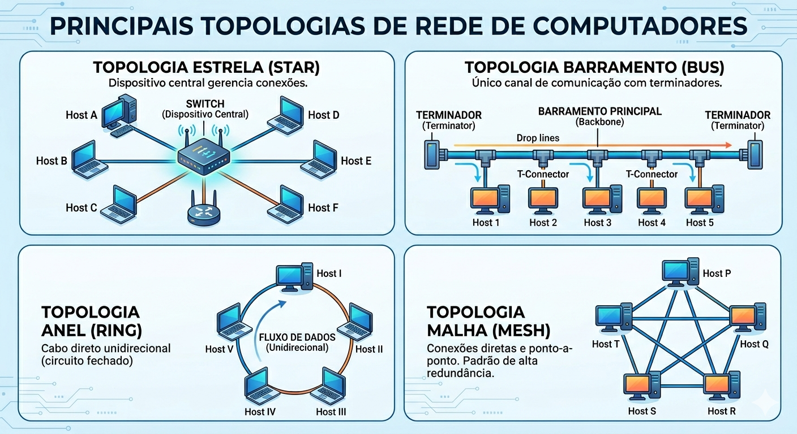

# Aula 11 – Redes de Computadores: Topologias, Dispositivos e Meios

## Objetivo
Entender a organização física e lógica das redes, identificar os principais dispositivos e reconhecer os diferentes meios de transmissão.

### 1. Diagramas de Topologias

### 2. Quadro Comparativo de Dispositivos

### 3. Meios de Transmissão

TANENBAUM, A. S.; FEAMSTER, N.; WETHERALL, D. J. Redes de computadores. 6. ed. São Paulo: Bookman, 2021. E-book. Disponível em: https://plataforma.bvirtual.com.br. Acesso em: 20 abr 2026.

## Reflexão Individual
Cada integrante deve produzir um texto curto (1 página) respondendo:  
**“Qual topologia seria mais adequada para a rede da sua residência e por quê?”**
